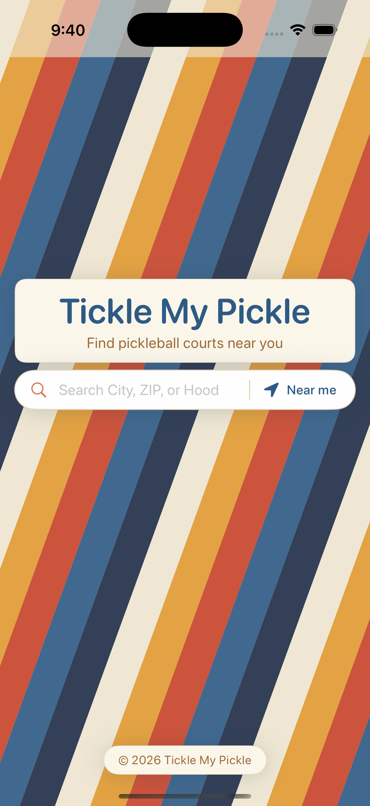

# 🥒 Tickle My Pickle (iOS)

A native SwiftUI app for finding pickleball courts near you. Type a city, ZIP,
or neighborhood — or use your location — and get numbered pins on a map plus a
ranked list of nearby courts with ratings, hours, amenities, and directions.

<p align="center">
  
</p>

## Features

- 🔎 **Search by text** — city, ZIP, or neighborhood, geocoded to a location
- 📍 **Search near me** — one-tap device geolocation
- 🗺️ **Map + list** — numbered pins on an Apple MapKit map, synced to a results list
- ⭐ **Ratings & hours** — Google rating, review count, and live open/closed status
- 🏷️ **Amenity badges** — indoor / outdoor / lighted / free, inferred from the listing
- 🧭 **Directions** — hand off to Maps for turn-by-turn
- 💾 **Favorites** — saved on-device, persist across launches

## How it works

The app deliberately splits its two Google concerns:

- **The map is Apple MapKit** — no API key, no Google Maps SDK. What you see is
  Apple Maps, on purpose.
- **Google is used for search data only** — the [Geocoding API](https://developers.google.com/maps/documentation/geocoding)
  (text → coordinates) and [Places API (New)](https://developers.google.com/maps/documentation/places/web-service)
  text search (find courts). A single iOS-app-restricted key covers both.

This is a ground-up rewrite of the earlier Expo/React Native app, which had to
juggle three Google keys and a growing `.native.tsx`/`.web.tsx` file split for a
fundamentally small app. Using MapKit for the map removes the map key and SDK
entirely, leaving one narrowly-scoped key for search. It shares no code with the
RN app or the sibling [`tickle-my-pickle`](https://github.com/punchjay/tickle-my-pickle)
web app.

## Tech stack

| | |
|---|---|
| **UI** | SwiftUI, iOS 17+ |
| **Language** | Swift 6 (strict concurrency) |
| **Map** | Apple MapKit |
| **Search data** | Google Geocoding + Places API (New), via plain `URLSession` |
| **Project files** | [XcodeGen](https://github.com/yonaskolb/XcodeGen) — the `.xcodeproj` is generated, not checked in |

No Expo, no React Native, no Google Maps SDK.

## Project structure

```
TickleMyPickle/
├── App/            App entry point
├── Models/         Court, LatLng, AmenityTag
├── Logic/          GooglePlacesClient (REST), LocationService, amenity inference
├── ViewModels/     PickleballMapViewModel (search/select state), FavoritesStore
├── Support/        Config, theme, fonts, centralized copy
└── Views/          RootView + Landing / Map / List / Search / Backdrop
TickleMyPickleTests/  Unit tests (data layer, view model, favorites, amenities)
project.yml           XcodeGen spec (source of truth for the Xcode project)
```

## Getting started

**Prerequisites:** Xcode 16+, and a Google Maps key (see below).

```bash
brew install xcodegen
cp Secrets.xcconfig.example Secrets.xcconfig   # then add your key (see comments in the file)
xcodegen generate
```

### Google Maps key

The key goes in `Secrets.xcconfig` (gitignored) as `GOOGLE_MAPS_REST_API_KEY`.
In Google Cloud Console → **APIs & Services → Credentials**, it must be:

- **iOS-app restricted** to bundle id `com.punchjay.ticklemypickle` (not
  HTTP-referrer restricted — the client sends an `X-Ios-Bundle-Identifier`
  header, so a web key returns `REQUEST_DENIED`)
- **API-restricted** to **Geocoding API** + **Places API (New)**, both enabled

Without a real key the app runs and shows a friendly "add a key" message rather
than failing every search.

## Build & run

Everything runs from the command line — no Xcode GUI needed.

```bash
xcodebuild -project TickleMyPickle.xcodeproj -scheme TickleMyPickle -configuration Debug \
  -destination 'platform=iOS Simulator,name=iPhone 17,OS=latest' -derivedDataPath build build

xcrun simctl boot "iPhone 17" 2>/dev/null || true
xcrun simctl bootstatus "iPhone 17" -b
xcrun simctl install booted build/Build/Products/Debug-iphonesimulator/TickleMyPickle.app
xcrun simctl launch booted com.punchjay.ticklemypickle
```

To test "Near me" in the Simulator, set a location:

```bash
xcrun simctl location booted set 47.6685,-122.3860   # Ballard, Seattle
```

## Tests

```bash
xcodebuild test -project TickleMyPickle.xcodeproj -scheme TickleMyPickle \
  -destination 'platform=iOS Simulator,name=iPhone 17,OS=latest' -derivedDataPath build
```

Covers the REST client (stubbed `URLSession`), the view-model search/geolocate
state machine (injected fakes), favorites persistence, and amenity inference.

## Roadmap

- [ ] Bundle real font files (Bebas Neue, DM Sans, Fredoka) into
      `Resources/Fonts/` and wire into `Support/Fonts.swift` — ships with a
      system-font fallback until then
- [x] Real app icon
- [ ] UI tests for the landing → results flow
